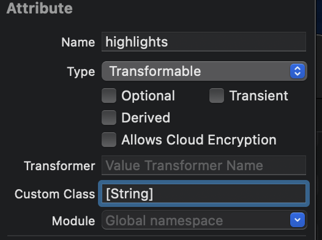
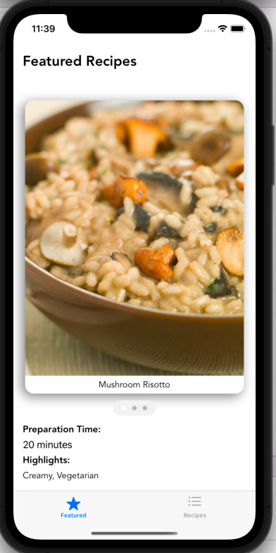
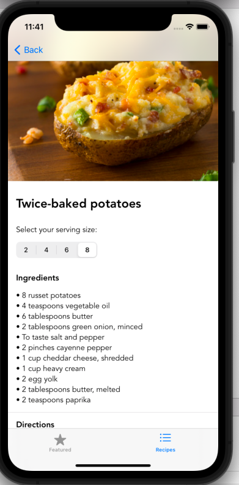

# Recipe App with Core Data
This app builds upon the amazing tutorial app from Code with Chris, with Chris's iOS Database course.
- https://learn.codewithchris.com/courses/take/databases/lessons/25253175-lesson-2-core-data-setup
- https://learn.codewithchris.com/courses/take/foundations/texts/20330438-lesson-14-challenge

It takes a previously built app, and shows how you can add permanent data, or Core Data to it. 

# Permanent Data Storage
## Initial Data Store Setup
When the user first launches the app, the data store contains nothing. Therefore, you must load objects into the data store
upon the first launch using an API or local JSON file. The easiest way to do this is to keep the current classes, rename them,
load data locally into them, then later on convert those objects into Core Data.

So you simply rename some of the classes like:
```
class Recipe: Identifiable, Decodable {
```
To:
```
class RecipeJSON: Identifiable, Decodable {
```

From here, you create a new `Data Model` file to define the Core Data entities that represent the ingredients and recipes 
used by the app. It is useful to use the Option + click to open up the the old classes with the 
data model side-by-side.

Note that you store images via the binary data type in Core Data. For arrays of strings, you can create them
in the right tab like this:


Once you create your Entities that mirror your classes, you can either
use the CodeGen, Class/ Extension, or Manual modes. If you choose to go with
Manual, then you will need to generate Subclasses for the Entities.
As of January 22, 2022, Xcode contains a bug that does not reflect 
Optional values in the generated code, therefore pay special attention to those. After fixing the Optional values in the new
class, build your project again, then fix any errors that pop-up. 

The final step is to get a PersistenceController in the app, in order to save our data long-term. To do this, you can make a 
new app with Persistence in it, then just copy that.

Then replace the code in the preview with classes used by your app (Preview section generates dummy data for the preview)
```
// Replace with items you use
let newItem = Item(context: viewContext)
// Becomes
let newItem = Recipe(context: viewContext)
```

Also, change the Persistence Controller name to match the name of the Core Data model, e.g. "Recipe Data Model":
```
// Change this
container = NSPersistentContainer(name: "Test_App")
```

Next, add the Persistence Controller to the entry point in the app (can get this from the demo app you made with this code):
```
.environment(\.managedObjectContext, persistenceController.container.viewContext)
``` 

As well as the line that initializes the persistenceController there:
```
let persistenceController = PersistenceController.shared
```

Then, add this line in order to get the viewContext needed for Core Data interactions:
```
@Environment(\.managedObjectContext) private var viewContext
```

## Pre-Load Core Data
We can parse the JSON file in our Data directory on the first time launch of the app, then after that use the Core Data store
for everything else.

You set equal the JSON versions of the objects to the Core Data properties: 
```
for r in localRecipes {
    // Create Recipe Core Data object inside the current managed object context
    let recipe = Recipe(context: managedObjectContext)
    
    // Set this empty Core Data recipe to match the properties from the JSON version
    recipe.cookTime = r.cookTime
    recipe.directions = r.directions
    recipe.featured = r.featured
    recipe.highlights = r.highlights
    // Set it equal to a new UUID versus the one from the JSON
    recipe.id = UUID()
```

However, for the relationship, you must use the built-in method in order to add it. Therefore, to add the ingredients to the 
recipe, you use this pre-built method `addToIngredients`. Note that the Recipe has this method, because there are many 
ingredients to one recipe. A one to many relationship from the other object to it. 


# Design




## Searching Recipes
The `RecipeListView` implements a `SearchBarView`


## Adding a Photo
In order to add a user-selected photo to the app, you must use a UIKit View to accomplish this. 

In addition, in order to use the user's camera we must add a new entry into the `Info.plist` permissions with a new row:


# Swift Concepts
The app incorporates the following concepts:
- List
- Reads the recipes in the data folder, and builds the app around that.

## Add Custom Font
Follow this guide to add a custom font to your application: https://www.simpleswiftguide.com/how-to-use-custom-fonts-in-swift-ios-app-using-swiftui/.
